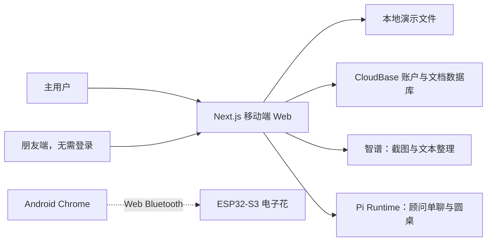

# WorthBloom · 好好花

> 把想买说清楚，把价值用起来。

WorthBloom 是一个围绕“消费前想清楚、消费后真正用起来”设计的移动端 Web 原型。它把心愿记录、AI 梳理、朋友回信、自主决定、存钱计划、购买后使用追踪和一朵可联动的桌面电子花串成一条完整路径。


项目目前处于 **P1 可运行原型**阶段，并获得 **Shenicest 千人黑客松软件赛道第二名**。你可以不注册、不配置数据库，直接在本地体验主要流程；AI、多人云端账户和实体电子花按需启用。欢迎体验并提出问题，可联系 `2603885096@qq.com`。

- 在线体验：[立即打开 WorthBloom](https://worthbloom-web-302528-11-1473737765.sh.run.tcloudbase.com)
- 项目介绍 PPT（启用 GitHub Pages 后）：[sherryxiaoqaq.github.io/worthbloom](https://sherryxiaoqaq.github.io/worthbloom/)
- 项目介绍 PPT 源文件：[docs/index.html](docs/index.html)
- 当前技术栈：Next.js 16、React 19、TypeScript、腾讯云 CloudBase、智谱 GLM、Pi Runtime、ESP32-S3

## 为什么做 WorthBloom

WorthBloom 主要面向容易陷入选择困难，或曾因冲动购物感到焦虑的人。很多消费工具只关心“买了什么、花了多少”，但真正困难的部分往往发生在付款前后：

- 付款前：喜欢、预算、使用频率、现实阻碍和替代方案混在一起，很难说清楚。
- 做决定时：朋友能提供真实关系中的第二视角，但最终选择仍应属于自己。
- 付款后：课程剩几次、会员何时到期、物品用了多少次，通常没有被持续记录。
- 回看时：人们很少知道这次消费是否真正进入生活，以及下次应该继续、换一种，还是不再买。

WorthBloom 不替你决定买不买。它做的是把事实、动机、不同视角和后续使用放在一起，让一次冲动变成有依据、可记录、能回看的选择。

## 一次完整的使用旅程

| 阶段 | 你会做什么 | WorthBloom 提供什么 |
| --- | --- | --- |
| 1. 种下心愿 | 记录一个商品，或比较最多 6 个候选商品 | 手动创建、链接导入、截图识别和多商品比较 |
| 2. 把问题说清楚 | 补充购买理由、顾虑、使用频率和现实条件 | AI 整理商品信息，并提出需要核对的问题 |
| 3. 听见不同视角 | 把同一邀请链接发到群聊或给朋友 | 朋友无需注册，可独立留下判断与理由，看不到其他人的回答 |
| 4. 自己做决定 | 选择“现在购买”“先存钱”或“再等等” | AI 顾问单聊、圆桌讨论、朋友共识与分歧整理；决定权始终在用户 |
| 5. 让决定进入行动 | 为目标存钱，或把已购买内容放进“我的果实” | 存钱进度、课程次数、储值余额、有效期、使用次数和单次成本 |
| 6. 回看真实价值 | 写下实际体验，以及下次是否还会选择 | 完成/到期后的回看归档、历史体验和个人成长记录 |

## 当前可以体验的功能

### 心愿与商品整理

- 创建单个商品心愿，或对多个候选商品逐个上传图片和填写价格。
- 从商品链接、分享文案或商品截图提取名称、价格、类型、次数、有效期等信息。
- AI 识别只负责预填；用户必须核对并确认后才会创建心愿。
- 淘宝、京东等页面如果阻止服务端读取，可以改用商品截图。

### 朋友回信与自主决定

- 同一个群聊邀请链接可以收集多份独立回信。
- 朋友无需账户，只能看到当前心愿所需的信息，不会进入主人的花园。
- 朋友看不到其他人的答案；心愿决定完成后，邀请链接自动关闭。
- 主用户可以查看原始回信、共识和分歧，再选择购买、存钱或等待。

### AI 决策顾问团

当前提供四种单聊视角，以及多顾问圆桌：

- 快速决策顾问：用少量问题确认当前倾向。
- 理性分析顾问：关注预算、频率、替代方案和机会成本。
- 回信分析顾问：整理朋友意见中的共识与分歧。
- 专家顾问：关注长期收益、冷静期和直觉信号。

### 购买后价值追踪

- 支持课程/次卡、会员、储值、实物和一次性体验。
- 记录使用次数、剩余次数、余额和有效期。
- 根据购入金额与真实使用次数计算 Cost per Use。
- 内容用完或到期后进入“待回看”，完成记录后归入“过去的果实”，数据不会被删除。

### 好好值与桌面电子花

- 好好值用于记录使用、表达和回看等行为，消费金额不会直接决定得分。
- ESP32-S3 圆屏与 SG90 舵机固件已包含在仓库中。
- Android Chrome 可以通过 Web Bluetooth 连接名为 `HaoHaoHua` 的设备，并发送 `0–100` 的进度值。

## 3 分钟本地体验

### 1. 准备环境

- Git
- Node.js `>= 22.13.0`
- pnpm

如果还没有 pnpm：

```bash
npm install -g pnpm
```

Windows PowerShell 遇到脚本执行策略限制时，可以把下面命令中的 `pnpm` 换成 `pnpm.cmd`。

### 2. 下载并启动

```bash
git clone https://github.com/SherryXiaoqaq/worthbloom.git
cd worthbloom
pnpm install
pnpm dev
```

浏览器打开：

```text
http://localhost:3000
```

点击“进入我的好好花”即可。这个模式不需要注册，也不需要 CloudBase。仓库自带“去冰岛看极光”、课程、陶艺课、耳机和存钱目标等示例数据，方便直接理解完整流程。

本地修改会保存在项目根目录的 `.worthbloom-local-state.json` 中，重启开发服务器后仍会恢复；该文件已被 `.gitignore` 排除，不会提交到仓库。

### 3. 推荐试玩顺序

1. 在花园中打开“去冰岛看极光”，查看三封示例朋友回信。
2. 进入“AI 对话”，切换四种顾问和圆桌模式。
3. 点击“种心愿”，分别查看单商品、多商品、链接、手动和截图入口。
4. 创建一个手动心愿，复制群聊邀请链接，并在无痕窗口中以朋友身份回信。
5. 回到主人页面，选择现在购买、先存钱或再等等，并写下决定理由。
6. 打开“我的果实”，记录一次课程/物品使用，观察单次成本变化，再写一条真实体验。
7. 在“我的”页面查看心愿、决定、回信、存钱目标和好好值记录。

### 4. 在手机上体验

电脑和手机连接同一个 Wi-Fi：

```bash
pnpm dev:lan
```

在手机中打开终端显示的 `Network` 地址，例如：

```text
http://192.168.1.23:3000
```

如果无法访问，请确认 Windows 防火墙允许 Node.js 使用专用网络。

## 启用 AI

不配置任何密钥也能体验心愿、朋友回信、决定、存钱和物资追踪。AI 能力分成两组：

| 配置 | 用途 |
| --- | --- |
| `ZHIPU_API_KEY` | 商品截图识别、链接信息整理和快速 AI 建议 |
| `OPENAI_NEXT_API_KEY` | Pi Runtime 下的四个决策顾问与圆桌讨论 |

在根目录创建 `.env.local`，只填写自己需要的服务端变量。完整示例与模型配置见 [`docs/ai-setup.md`](docs/ai-setup.md) 和 [`.env.example`](.env.example)。保存后需要重启开发服务器。

不要把真实密钥添加 `NEXT_PUBLIC_` 前缀，也不要提交 `.env.local`、把密钥写进截图或发到群聊。

## 多账户与持久化部署

默认本地模式只有一个演示主人。若要让不同用户通过邮箱注册并持久保存各自的数据，需要配置腾讯云 CloudBase：

- CloudBase 环境、地域和 Publishable Key
- 仅服务端使用的 API Key
- 身份认证、文档数据库集合与安全来源
- 部署环境中的 AI Secrets（可选）

从零配置步骤见 [`CLOUDBASE_SETUP.md`](CLOUDBASE_SETUP.md)。不要直接把 `.env.example` 中的占位符复制进 `.env.local`；没有使用的 CloudBase 变量应保持不存在，而不是保留 `your-...`。

## 系统如何协作



本地文件与 CloudBase 是两种数据运行模式；电子花 BLE 是独立的可选增强层。即使 AI 或硬件不可用，用户仍可手动完成核心流程。

## 硬件体验

当前硬件版本使用：

- 微雪 `ESP32-S3-Touch-LCD-1.28`
- SG90 舵机
- Android Chrome Web Bluetooth
- BLE 设备名 `HaoHaoHua`

烧录、接线、UUID、舵机角度和安全注意事项见 [`hardware/README.md`](hardware/README.md)。Web Bluetooth 通常需要 Android Chrome 和 HTTPS；iPhone Safari 不适合作为当前原型的测试端。

## 技术栈

| 层级 | 实现 |
| --- | --- |
| Web | Next.js 16、React 19、TypeScript、CSS Modules |
| 数据 | 本地 JSON 状态文件；腾讯云 CloudBase 文档数据库 |
| AI 信息整理 | 智谱 GLM 视觉/文本模型 |
| AI 顾问团 | Pi Runtime、DeepSeek 兼容模型网关 |
| 硬件 | ESP32-S3、圆屏、BLE、SG90 舵机、PlatformIO |
| 安全 | 服务端密钥、CloudBase 身份认证、数据归属隔离、邀请 token |

## 项目结构

```text
app/
  api/                    数据、AI、朋友回信、资料与设备接口
  review/                 朋友端邀请页面
  agent-panel.tsx         AI 顾问单聊、圆桌与历史对话
  worthbloom-create.tsx   单商品/多商品心愿创建流程
  worthbloom-views.tsx    花园、心愿、存钱、果实与个人页
lib/
  server/                 本地、CloudBase、AI 与权限逻辑
  asset-rules.ts          物资使用、单次成本和回看规则
  multi-product.ts        多商品心愿的数据格式
docs/
  index.html              HTML 路演稿
  ai-setup.md             AI 配置说明
hardware/
  README.md               BLE 电子花零基础指南
  firmware/               ESP32-S3 PlatformIO 固件
tests/evals/              AI 顾问案例与 API 冒烟测试
```

## 质量检查

准备提交代码前运行：

```bash
pnpm lint
pnpm build
pnpm eval:agent
```

如果需要检查已经启动的顾问 API：

```bash
pnpm eval:agent:api
```

## 隐私与产品边界

- AI 负责整理和提供视角，不会替用户点击最终决定。
- 朋友只通过邀请链接访问对应心愿，看不到主人的其他记录或其他朋友答案。
- CloudBase 模式按主人身份隔离数据，服务端密钥不会进入浏览器代码。
- 购物画像只在用户主动同意后生成结构化结果；CloudBase 不保存原始购物截图。
- 电子花只接收进度数字，不需要获得朋友昵称、回信或账户隐私。
- 这是黑客松原型，不应作为财务建议、资金托管或生产级账户系统直接使用。

## 当前限制

- 商品网站可能限制自动读取，截图导入通常更稳定。
- AI 服务可能受到模型额度、限流或第三方网关状态影响。
- 完整多人模式需要自行配置 CloudBase；本地演示不提供真实的多账户隔离。
- BLE 电子花目前主要面向 Android Chrome，机械结构仍处于原型阶段。
- 项目仍需要补充更完整的自动化回归、真实多账号测试、无障碍检查和线上监控。

如果你只是第一次路过，先运行本地演示、打开示例心愿，再从“我的果实”看一眼购买后的使用追踪——这三步最能说明 WorthBloom 与普通记账或购物清单的区别。

感谢每一位愿意体验 WorthBloom 的朋友。我们期待听到你的真实感受、问题和建议；欢迎通过 `2603885096@qq.com` 联系我们。
